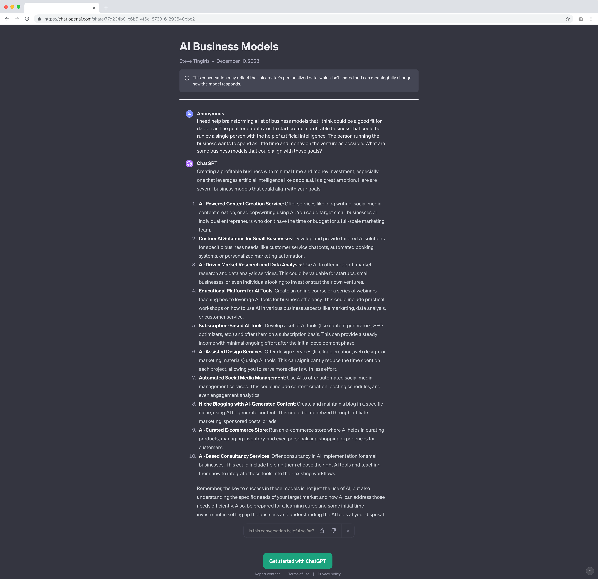
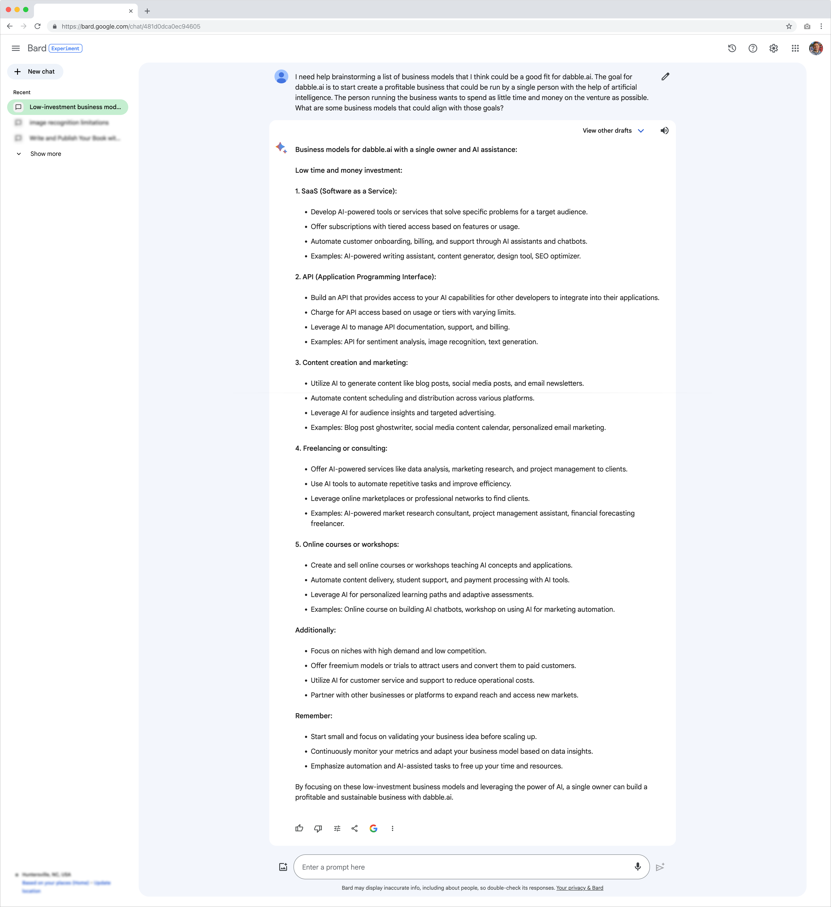
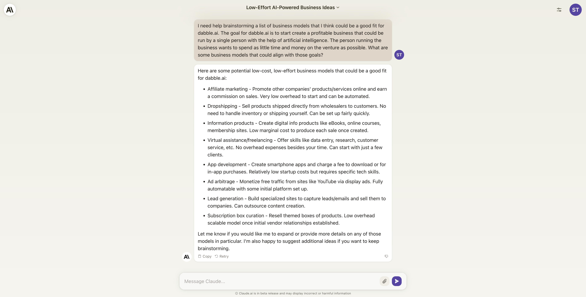

# Day 2

It's December 10, 2023 and it's 05:11 AM EST. I woke up this morning early, thinking about dabble.ai. For me, it's a good sign when I wake up thinking about a project I'm working on. For this project however, I'm not sure if that's a good thing. The goal is to create a profitable business using AI, with as little of my time and money as possible. So, I need to be careful not to get too excited about this project and spend too much time on it. So, I'm going to try and limit myself to no more than 2 hours a day. That said, let's get back to it.

I just reread what I wrote yesterday. Well actually, "I" didn't write most of it. I generated most of it using [GitHub Copilot](https://resources.github.com/copilot-for-business). I'm likely going to go back and make some changes. I want everything to like something I would have written myself, without the help of AI. To make that happen, you need to take time to edit what the AI is generating to make it sound more like the way you would have written it. This is important because the AI is looking back as what was previously written and trying to generate text that is similar. So, as you make edit, the AI generated text will start to sound more like you. One of the reasons I like writing in VS Code, using CoPilot is because making revisions and edits easier to do than with tools like ChatGPT, Bard, or Claud.ai. I'll share more about this later. But for now, I want to get back to the business model.

## The business model

I'm going to start by brainstorming a list of business models that I think could be a good fit for dabble.ai. I'm going to use CoPilot to help me with this. But, I'm also going to use ChatGPT, Bard, and Claud.ai. I'm going to use all of them because I want to see which one works best for this type of task. I'm also going to use them all because I want to see how they compare to each other. I'll start with CoPilot because that's the tool I'm using right now.

    TIP: CoPilot tends to get "confused" at times and it will write the same sentence over an over. I just delete the duplicates. I'm not exactly sure why it does this. But it's not a big deal to me. I just delete the duplicates and move on.

To keep things fair and consistent, I'm going to use the same prompt for each tool. The prompt I'm going to use is:

```
I need help brainstorming a list of business models that I think could be a good fit for dabble.ai. The goal for dabble.ai is to start create a profitable business that could be run by a single person with the help of artificial intelligence. The person running the business wants to spend as little time and money on the venture as possible. What are some business models that could align with those goals?
```

On second thought, I'm not going to include CoPilot in this comparison. That's because CoPilot works a little differently than the other tools. CoPilot is not really designed for this kind of prompting. So, I'll start with ChatGPT, then Bard, and finally Claud.ai. I'll share the results from each tool below.

### ChatGPT

So, [here is what ChatGPT returned](https://chat.openai.com/share/77d234b8-b6b5-4f6d-8733-61293640bbc2) when I used the prompt above. 



### Bard
Google's [Bard](https://research.google/tools/bard/) returned the [following results](https://g.co/bard/share/c05c44b7240e):



### Claud.ai

Claude.ai returned the following results:



### My thoughts

It's 6:25 AM now, so I have about 45 minutes to wrap things up for today. As a side note, I'm spending time on things like creating screenshots and links as I go. I'm doing this because I want to make sure I'm documenting everything I do. But if I didn't have that as one of my objectives - if I just wanted to create a profitable business - I wouldn't be spending time on that stuff. It's too much effort to try and track exactly how much time I'm spending documenting the process vs actually working on the business. But that's something I need to keep in mind. Now, back to the business model.

I did a quick read of the results. For the most part, all of the tools did a good job from my perspective. But at this point, it's all very high-level. In my case, I have experience with a number of different business models. So, I'm going to use that experience to help me decide which business model to pursue. But if I didn't have that experience, I would probably use the results from the AI tools to help me decide. I would also do some research on each of the business models to see which one I thought would be the best fit. I'm not going to do that now because I already have a good idea of which business model I want to pursue. But I'll share more about that in the next post.

It's now 6:43 AM. I'm going to spend the next 15 minutes or so editing what I have so far and publishing it on GitHub. I'll pick up where I left off tomorrow. I'll share more about the business model I'm going to pursue. And I'll work on creating a plan for how I'm going to use AI to help me with everything. I'll also share more about how I'm using CoPilot to write this document. 

Continue reading... [Day 3 - The business model (continued)](./DAY3.md)
